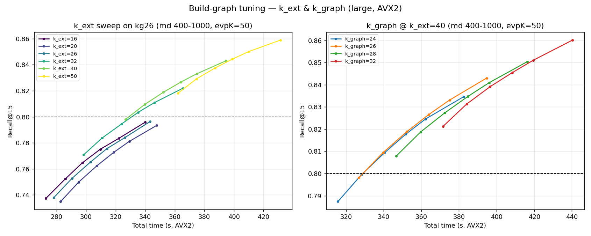

# Build-Graph Tuning — k_ext & k_graph (Large, AVX2)

Investigation of Nico's hypothesis: *a higher `k_ext` builds a better graph and therefore needs less `max_dist`*. All on the 6.35 M set, **AVX2** image, mode4, `non_zeros=600`, `eps_ext=0.001`, `prune≈35% of k_graph`, `evpK=50`.

## 1. k_ext sweep (fixed k_graph=26)

| k_ext | build (s) | max recall (md≤1000) | first md ≥0.8 | fastest ≥0.8 |
|--:|--:|--:|--:|--|
| 16 | 154 | 0.7958 | — | **never reaches 0.8** |
| 20 | 159 | 0.7934 | — | **never reaches 0.8** |
| 26 | 157 | 0.7963 | — | **never reaches 0.8** |
| 32 | 175 | 0.8220 | 700 | 335 s (md700, r0.8035) |
| 40 | 206 | 0.8430 | 500 | 340 s (md500, r0.8095) |
| 50 | 239 | 0.8589 | 400 | 362 s (md400, r0.8182) |

**Findings:** (1) Sharp quality threshold — `k_ext ≤ 26` never reaches 0.8 on large (max ~0.79 even at md=1000); `k_ext=32` is the minimum viable. (2) Nico confirmed: higher k_ext reaches 0.8 at progressively *lower* max_dist and lifts max recall. (3) But build cost grows faster than the search saving, so the **fastest-to-0.8 stays ≈ k_ext=32**. (4) Higher k_ext buys recall **margin** for little extra time — useful for the safety-ladder slots. This contradicts the small-data result (k_ext was recall-neutral there) — k_ext's importance is **size-dependent**.

## 2. k_graph at the better k_ext=40

Does the build-vs-search optimum shift to a different k_graph once the graph is better built? (kg26 row reuses the k_ext-sweep data; same params.)

| k_graph | build (s) | max recall | first md ≥0.8 | fastest ≥0.8 |
|--:|--:|--:|--:|--|
| 24 | 194 | 0.8346 | 600 | 340 s (md600, r0.8094) |
| 26 | 206 | 0.8430 | 500 | 340 s (md500, r0.8095) |
| 28 | 225 | 0.8504 | 400 | 347 s (md400, r0.8079) |
| 32 | 251 | 0.8601 | 400 | 372 s (md400, r0.8213) |

## 3. Verdict

- **Fastest config ≥0.8 across these build-tuning runs:** kg26, k_ext=32, max_dist=700, evpK=50 → recall 0.8035 @ **335 s (AVX2)**. This **confirms (does not beat) the submission winner** (kg26, k_ext=32, nz=608 → 0.802 @ 328 s); the ~7 s gap is just the nz=600/eps=0.001 variant here needing md=700 instead of md=600 — i.e. the 0.80@md600 margin is genuinely on the knife's edge.

- **`k_ext` floor is 32** — never go below it on large.

- Higher `k_ext` (40–50) does not win on speed but gives more recall margin at similar time; good for the robustness/insurance submission slots.

- `k_graph` around 26 remains the build-vs-search sweet spot; see the table above for whether the better k_ext shifts it.
