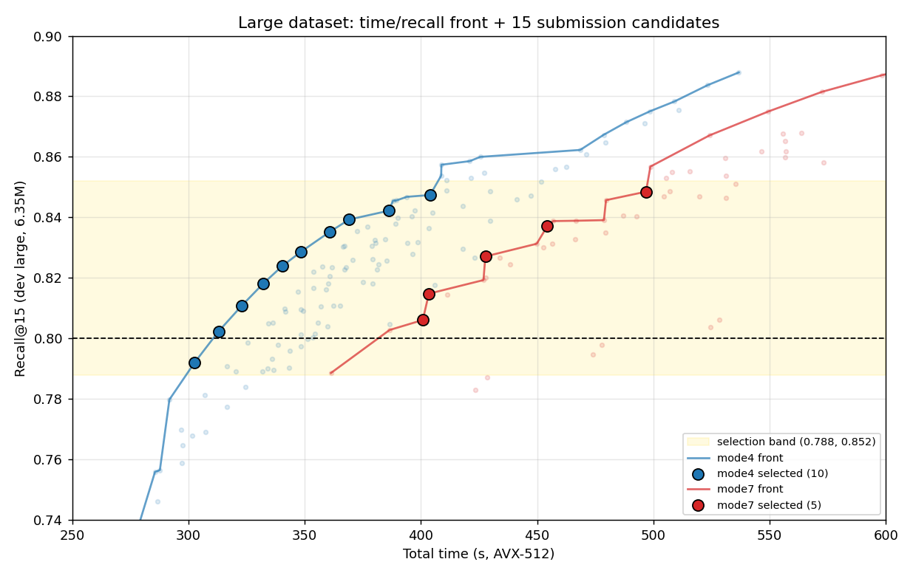
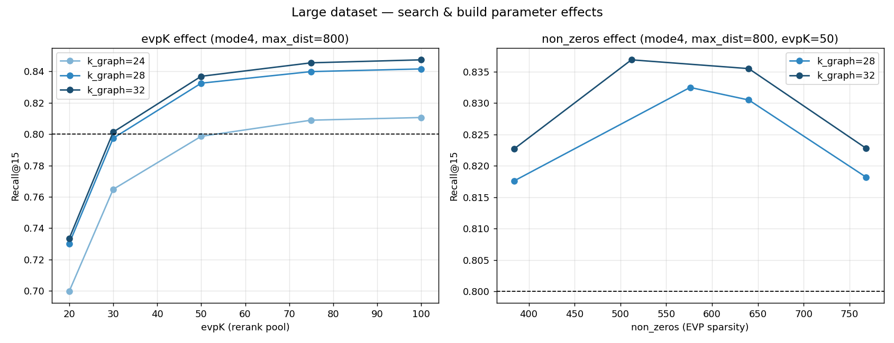

# SISAP 2026 deglib — Large-Dataset Tuning & Submission Candidates

Companion to the small-dataset report. Target: **Wikipedia BGE-M3 large** (6.35 M vectors, 1024-dim, dot product), self-join k=15, on the AVX-512 VM (8 vCPU / 24 GB).

## 0. Objective (challenge rules)

The challenge runs on a **6.35 M holdout** of the same size/distribution. We submit **15 configs**; all are run and the **fastest one reaching Recall@15 ≥ 0.8 is reported**. So we optimise for **speed at the 0.8 boundary**, not maximum recall — anything well above 0.8 is wasted time.

## 1. Method

- **Build-once + search sweep** (deterministic grid, not Optuna): each run builds the EVP graph once and sweeps `max_dist × evpK` over it. Justified because (a) build dominates and re-searching build params would rebuild the 6.35 M graph every trial, and (b) the small report showed build-params translate while only the search budget doesn't.

- **Carried build-param families** from the small Pareto fronts; refined `k_graph` 22→40 with a fine `max_dist` grid {400…1400}; bonus tiers swept `evpK ∈ {20,30,50,75,100}` and `non_zeros ∈ {384,512,640,768}`. `eps_ext` fixed at 0.002 (small report: non-driver of recall + build-time bomb). `threads=8`, `k_top=15` fixed.

- **186 configurations measured** (~9.4 h). **AVX-512 timings** — recall is SIMD-independent (final), but the *time* ranking that picks the winner must be re-measured on the AVX2 target server (see §6).

## 2. Headline result

**Fastest config ≥ 0.8: mode4, k_graph=26, max_dist=600, evpK=50, non_zeros=608 → recall 0.8023 @ 313 s.** First configuration in this project to clear 0.8 on large comfortably (the repo's prior hand-tuned best was 0.7914).

## 3. Pareto front & the 15 candidates

Both fronts rise steeply then plateau; the **mode4 front sits ~90 s left of mode7 at every recall level** — mode4 dominates for speed-to-0.8. Selection band is recall ∈ [0.79, 0.85], denser at the bottom (fastest winners + a sub-0.80 bet) and thinner toward 0.85 (insurance).

### Build-vs-search trade-off — k_graph=26 is the sweet spot

Total time = build + search. Lower `k_graph` = cheaper build but needs more `max_dist` to reach 0.8; higher `k_graph` = pricier build, less search. The fastest ≥0.8 per degree:

| k_graph | build (s) | fastest ≥0.8 (max_dist) | recall | total (s) |
|--:|--:|--:|--:|--:|
| 24 | 167 | 900 | 0.8049 | 334 |
| 26 | 184 | 600 | 0.8023 | 313 |
| 28 | 228 | 500 | 0.8090 | 349 |
| 30 | 228 | 500 | 0.8015 | 354 |
| 32 | 228 | 400 | 0.8052 | 336 |
| 36 | 302 | 400 | 0.8297 | 418 |
| 40 | 332 | 400 | 0.8473 | 447 |

`k_graph ≤ 22` can't reach 0.8 at all (recall ceiling too low — too sparse); `k_graph=26` minimises total time at the boundary; `k_graph ≥ 32` only pays off above ~0.84.

## 4. Parameter findings

- **evpK = 50 is the sweet spot.** evpK=20 craters recall (0.70–0.73 — pool too small); evpK=30 just reaches ~0.80; evpK=75/100 add only ~+0.01 for +12–27 s. evpK=30 is a faster-but-risky option for the aggressive slots.

- **`non_zeros` translated from small.** Recall peaks at the carried-over values (~512–608) and *drops* at 384 and 768 — confirming the small-optimal quantisation sparsity is also best at scale.

- **`k_graph` is the dominant build-cost driver** and the key build knob; the boundary optimum is 26.

## 5. small → large translation verdict

- **Build-graph params translate.** `non_zeros` optimum is unchanged; the `k_graph` recall ordering holds (more degree → more recall at both scales).

- **`max_dist` does NOT translate 1:1.** The same config loses ~0.10–0.14 recall going 200 K → 6.35 M, so the budget to reach a given recall grows ~2–3× (small cleared 0.8 at `max_dist`≈200–400; large needs ≈600 at k_graph=26). This was the key reason to re-tune only the search budget at scale.

- **mode4 > mode7 holds at both scales.**

## 6. The 15 submission candidates

Recall-safety ladder (two-sided hedge against the dev→live recall shift, whose direction is unknown): one sub-0.80 *aggressive* slot (wins if live ≥ dev), the fastest safe crosser, and a tail up to ~0.85 (insurance if live is harder). 10 mode4 + 5 mode7.

| slot | mode | k_graph | k_ext | prune_worst | non_zeros | max_dist | evpK | recall (dev large) | total (s, AVX-512) |
|--:|--|--:|--:|--:|--:|--:|--:|--:|--:|
| 1 | mode4 | 26 | 32 | 9 | 608 | 500 | 50 | 0.7920 | 303 |
| 2 | mode4 | 26 | 32 | 9 | 608 | 600 | 50 | 0.8023 | 313 |
| 3 | mode4 | 26 | 32 | 9 | 608 | 700 | 50 | 0.8109 | 323 |
| 4 | mode4 | 26 | 32 | 9 | 608 | 800 | 50 | 0.8181 | 332 |
| 5 | mode4 | 26 | 32 | 9 | 608 | 900 | 50 | 0.8239 | 340 |
| 6 | mode4 | 26 | 32 | 9 | 608 | 1000 | 50 | 0.8286 | 348 |
| 7 | mode4 | 26 | 32 | 9 | 608 | 1200 | 50 | 0.8353 | 361 |
| 8 | mode4 | 26 | 32 | 9 | 608 | 1400 | 50 | 0.8393 | 369 |
| 9 | mode4 | 32 | 24 | 11 | 512 | 900 | 50 | 0.8422 | 386 |
| 10 | mode4 | 32 | 24 | 11 | 512 | 800 | 100 | 0.8474 | 404 |
| 11 | mode7 | 28 | 34 | 10 | 576 | 400 | 50 | 0.8061 | 401 |
| 12 | mode7 | 32 | 24 | 11 | 512 | 400 | 50 | 0.8148 | 403 |
| 13 | mode7 | 32 | 24 | 11 | 512 | 500 | 50 | 0.8271 | 428 |
| 14 | mode7 | 32 | 24 | 11 | 512 | 600 | 50 | 0.8372 | 454 |
| 15 | mode7 | 28 | 34 | 10 | 576 | 800 | 75 | 0.8485 | 497 |

All share `eps_ext=0.002`, `k_top=15`, `threads=8`. Build params `k_ext`, `prune_worst`, `eps_ext` and (per build-config) `non_zeros` were carried/interpolated from the small fronts — only `k_graph`, `max_dist`, `evpK` (+ the evpK/non_zeros sensitivity tiers) were swept on large. mode4 is the win bet; the 5 mode7 are a higher-recall-per-config hedge (slower, but more margin if the live set is harder).

## 7. Caveats & next steps

- **AVX-512 timings only.** The recall column is final (SIMD-independent), but the evaluation server is **AVX2-only**, so the time ranking — and possibly the mode4/mode7 order — can shift. **Re-time these 15 on an AVX2 build** (`docker build --build-arg FORCE_AVX2=ON`) before final submission; that run decides the winner.

- The mode4 ladder is `k_graph=26`-heavy (it *is* the front across 0.79–0.84); 1–2 slots could be swapped for `k_graph=24/28` build-diversity if hedging against degree-specific behaviour on the live set.
