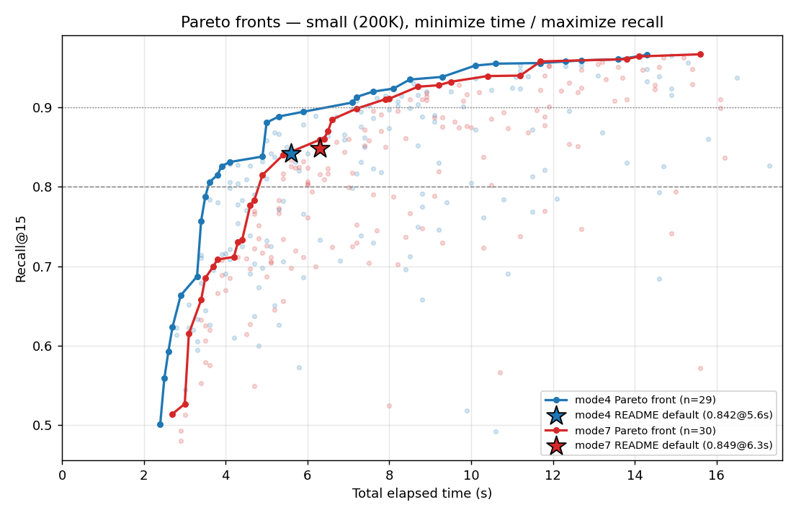
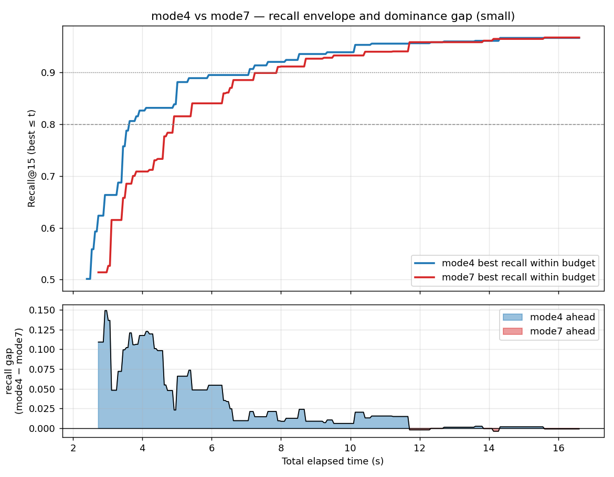
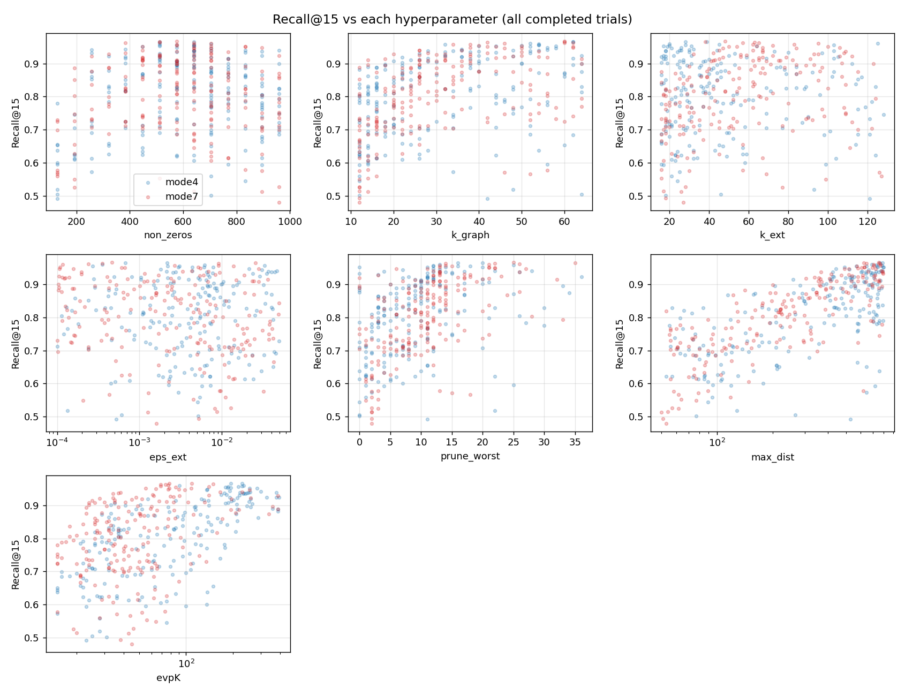
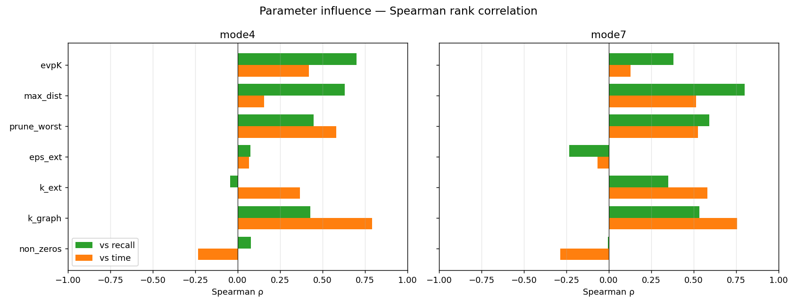

# SISAP 2026 deglib — Small-Dataset Hyperparameter Tuning Report

Multi-objective Optuna search (TPE) on Wikipedia BGE-M3 **small** (200K vectors, 1024-dim, dot product) on the AVX-512 VM (8 vCPU / 24 GB). Objective: **minimize total elapsed time, maximize Recall@15** (Pareto). `threads=8` and `k_top=15` fixed.

Search space (per trial, with constraints `evpK≥15`, `max_dist≥evpK`, `prune_worst<k_graph`):

| param | range |
|---|---|
| non_zeros | 128–960 (step 64) |
| k_graph | 12–64 (even) |
| k_ext | 16–128 |
| eps_ext | 1e-4–5e-2 (log) |
| prune_worst | 0 … 0.6·k_graph |
| max_dist | 50–800 (log) |
| evpK | 15 … min(400, max_dist) (log) |

200 trials per mode. Completed (non-failed) trials analysed: mode4 = 199, mode7 = 197. Pareto front sizes: mode4 = 29, mode7 = 30.

## 1. Pareto fronts

Both fronts share the same shape: a **steep rise then a long plateau** — most recall is bought cheaply, with sharp diminishing returns past ~0.9.

### Recall reachable within a time budget

| time budget | mode4 best recall | mode7 best recall |
|--:|--:|--:|
| ≤4s | 0.8259 | 0.7084 |
| ≤5s | 0.8808 | 0.8148 |
| ≤6s | 0.8944 | 0.8398 |
| ≤8s | 0.9197 | 0.9108 |
| ≤10s | 0.9383 | 0.9321 |
| ≤12s | 0.9557 | 0.9577 |
| ≤14s | 0.9603 | 0.9606 |

### Knees (cheapest front config clearing each recall bar)

| threshold | mode | time (s) | config |
|--|--|--:|--|
| ≥0.80 | mode4 | 3.6 | nz=704, kg=18, kext=26, prune=4, md=404, evpK=37 |
| ≥0.80 | mode7 | 4.9 | nz=640, kg=18, kext=48, prune=9, md=221, evpK=33 |
| ≥0.90 | mode4 | 7.1 | nz=576, kg=28, kext=37, prune=10, md=491, evpK=178 |
| ≥0.90 | mode7 | 7.9 | nz=576, kg=26, kext=82, prune=13, md=444, evpK=41 |
| ≥0.95 | mode4 | 10.1 | nz=512, kg=40, kext=31, prune=14, md=742, evpK=193 |
| ≥0.95 | mode7 | 11.7 | nz=576, kg=34, kext=62, prune=13, md=771, evpK=69 |

## 2. mode4 vs mode7

Top: best recall reachable within a time budget (the monotone envelope of each front). Bottom: the gap (mode4 − mode7) — positive where mode4 dominates. mode4 leads across the cheap region and the two converge at the expensive tip.

- Peak recall: **mode4 = 0.9659** (14.3s), **mode7 = 0.9667** (15.6s).

- At matched time budgets [4, 5, 6, 8, 10, 12, 14], the higher-recall mode is mode4 in 5 and mode7 in 2 of them (see the table above). Asymmetric search (mode7) keeps the full-precision query, costing a little explore time for a slightly better candidate pool.

## 3. Parameter influence

Spearman rank correlation of each parameter with recall and with time (mode4 / mode7):

| param | ρ recall (m4) | ρ time (m4) | ρ recall (m7) | ρ time (m7) |
|---|--:|--:|--:|--:|
| non_zeros | +0.08 | -0.23 | -0.01 | -0.29 |
| k_graph | +0.43 | +0.79 | +0.54 | +0.76 |
| k_ext | -0.04 | +0.37 | +0.35 | +0.58 |
| eps_ext | +0.08 | +0.07 | -0.23 | -0.07 |
| prune_worst | +0.45 | +0.58 | +0.59 | +0.53 |
| max_dist | +0.63 | +0.16 | +0.80 | +0.52 |
| evpK | +0.70 | +0.42 | +0.38 | +0.13 |

Reading: large positive ρ with recall = strong recall driver; large positive ρ with time = strong cost driver. `max_dist`/`evpK`/`k_graph` drive recall (and cost); `eps_ext` mostly drives cost with weak recall signal; low `non_zeros` hurts recall.

## 4. Comparison to the README baseline

README/benchmarks.md only ever measured the single **default** config per mode. On the matched AVX-512 hardware:

| | config | time | recall |
|---|---|--:|--:|
| mode4 README default | k_graph=32, max_dist=200, evpK=50 | 5.6s | 0.8415 |
| mode4 tuned @ ~6s | best front config within budget | ≤5.6s | 0.8884 |
| mode4 tuned ceiling | best overall | 14.3s | 0.9659 |
| mode7 README default | k_graph=32, max_dist=200, evpK=50 | 6.3s | 0.8485 |
| mode7 tuned @ ~6s | best front config within budget | ≤6.3s | 0.8591 |
| mode7 tuned ceiling | best overall | 15.6s | 0.9667 |

So tuning lifts recall by ~+0.05 at matched time, and the ceiling (~0.96) far exceeds anything previously measured (~0.84).

## 5. Translation hypothesis for the large dataset

- **Likely transfer ~1:1** (graph-quality knobs, dataset-size independent): `non_zeros`, and the *ranking* of `k_graph`, `prune_worst`, `k_ext`, `eps_ext`.
- **Likely NOT 1:1** (must be re-tuned at scale): `max_dist` — navigating 6.35M vs 200K needs a larger budget for the same recall — and to a lesser extent `evpK`.

Implication: rather than a blind 200-trial large search (~1.5–2 days, much wasted on timed-out builds), **carry over good build-configs from this front, build each large graph once (`--graph` save), and sweep `max_dist`×`evpK` cheaply on the saved graph**.

## Appendix — full Pareto fronts

### mode4 front (29 points)

| time (s) | recall | non_zeros | k_graph | k_ext | eps_ext | prune | max_dist | evpK |
|--:|--:|--:|--:|--:|--:|--:|--:|--:|
| 2.4 | 0.5014 | 704 | 12 | 18 | 0.0051 | 0 | 77 | 31 |
| 2.5 | 0.5586 | 704 | 12 | 21 | 0.0053 | 1 | 94 | 28 |
| 2.6 | 0.5928 | 896 | 12 | 17 | 0.0057 | 4 | 719 | 23 |
| 2.7 | 0.6233 | 448 | 12 | 23 | 0.0057 | 1 | 130 | 22 |
| 2.9 | 0.6632 | 896 | 12 | 16 | 0.0121 | 4 | 577 | 30 |
| 3.3 | 0.6871 | 576 | 14 | 16 | 0.0232 | 7 | 98 | 39 |
| 3.4 | 0.7570 | 768 | 16 | 19 | 0.0061 | 2 | 576 | 28 |
| 3.5 | 0.7872 | 704 | 14 | 29 | 0.0017 | 3 | 707 | 31 |
| 3.6 | 0.8057 | 704 | 18 | 26 | 0.0025 | 4 | 404 | 37 |
| 3.8 | 0.8148 | 768 | 14 | 38 | 0.0008 | 3 | 666 | 37 |
| 3.9 | 0.8259 | 640 | 16 | 37 | 0.0038 | 8 | 620 | 38 |
| 4.1 | 0.8311 | 704 | 16 | 31 | 0.0025 | 3 | 431 | 86 |
| 4.9 | 0.8380 | 384 | 12 | 16 | 0.0105 | 6 | 742 | 95 |
| 5.0 | 0.8808 | 768 | 18 | 41 | 0.0087 | 9 | 586 | 78 |
| 5.3 | 0.8884 | 576 | 16 | 74 | 0.0085 | 6 | 561 | 48 |
| 5.9 | 0.8944 | 576 | 22 | 29 | 0.0067 | 10 | 533 | 113 |
| 7.1 | 0.9060 | 576 | 28 | 37 | 0.0026 | 10 | 491 | 178 |
| 7.2 | 0.9130 | 640 | 26 | 40 | 0.0065 | 10 | 533 | 195 |
| 7.6 | 0.9197 | 512 | 36 | 16 | 0.0030 | 11 | 498 | 125 |
| 8.1 | 0.9235 | 512 | 32 | 22 | 0.0071 | 11 | 555 | 190 |
| 8.5 | 0.9349 | 576 | 32 | 24 | 0.0077 | 11 | 694 | 231 |
| 9.3 | 0.9383 | 640 | 34 | 18 | 0.0065 | 12 | 753 | 221 |
| 10.1 | 0.9525 | 512 | 40 | 31 | 0.0078 | 14 | 742 | 193 |
| 10.6 | 0.9549 | 640 | 50 | 20 | 0.0031 | 12 | 738 | 179 |
| 11.7 | 0.9557 | 576 | 54 | 28 | 0.0022 | 18 | 647 | 186 |
| 12.3 | 0.9576 | 640 | 32 | 45 | 0.0331 | 12 | 782 | 228 |
| 12.7 | 0.9591 | 704 | 54 | 20 | 0.0062 | 25 | 730 | 234 |
| 13.6 | 0.9603 | 512 | 52 | 125 | 0.0004 | 13 | 689 | 91 |
| 14.3 | 0.9659 | 640 | 62 | 28 | 0.0022 | 20 | 766 | 193 |

### mode4 top-10 by recall

| # | recall | time (s) | non_zeros | k_graph | k_ext | eps_ext | prune | max_dist | evpK |
|--:|--:|--:|--:|--:|--:|--:|--:|--:|--:|
| 131 | 0.9659 | 14.3 | 640 | 62 | 28 | 0.0022 | 20 | 766 | 193 |
| 143 | 0.9653 | 14.9 | 512 | 62 | 39 | 0.0007 | 16 | 787 | 228 |
| 110 | 0.9603 | 13.6 | 512 | 52 | 125 | 0.0004 | 13 | 689 | 91 |
| 138 | 0.9591 | 12.7 | 704 | 54 | 20 | 0.0062 | 25 | 730 | 234 |
| 162 | 0.9576 | 12.3 | 640 | 32 | 45 | 0.0331 | 12 | 782 | 228 |
| 129 | 0.9559 | 15.3 | 512 | 54 | 103 | 0.0003 | 16 | 568 | 216 |
| 134 | 0.9557 | 11.7 | 576 | 54 | 28 | 0.0022 | 18 | 647 | 186 |
| 72 | 0.9549 | 10.6 | 640 | 50 | 20 | 0.0031 | 12 | 738 | 179 |
| 133 | 0.9525 | 12.7 | 640 | 58 | 64 | 0.0060 | 20 | 490 | 185 |
| 164 | 0.9525 | 10.1 | 512 | 40 | 31 | 0.0078 | 14 | 742 | 193 |

### mode7 front (30 points)

| time (s) | recall | non_zeros | k_graph | k_ext | eps_ext | prune | max_dist | evpK |
|--:|--:|--:|--:|--:|--:|--:|--:|--:|
| 2.7 | 0.5141 | 640 | 12 | 17 | 0.0087 | 2 | 54 | 20 |
| 3.0 | 0.5266 | 960 | 12 | 28 | 0.0128 | 2 | 57 | 46 |
| 3.1 | 0.6150 | 768 | 12 | 29 | 0.0143 | 2 | 77 | 29 |
| 3.4 | 0.6576 | 704 | 12 | 18 | 0.0108 | 3 | 155 | 26 |
| 3.5 | 0.6849 | 576 | 14 | 16 | 0.0232 | 7 | 98 | 21 |
| 3.7 | 0.6999 | 576 | 16 | 17 | 0.0130 | 8 | 106 | 40 |
| 3.8 | 0.7084 | 768 | 18 | 20 | 0.0136 | 4 | 109 | 39 |
| 4.2 | 0.7116 | 448 | 12 | 25 | 0.0006 | 3 | 248 | 44 |
| 4.3 | 0.7301 | 704 | 12 | 35 | 0.0204 | 1 | 158 | 58 |
| 4.4 | 0.7327 | 704 | 14 | 16 | 0.0055 | 2 | 325 | 36 |
| 4.6 | 0.7762 | 768 | 20 | 18 | 0.0060 | 10 | 220 | 41 |
| 4.7 | 0.7832 | 704 | 22 | 20 | 0.0046 | 11 | 192 | 35 |
| 4.9 | 0.8148 | 640 | 18 | 48 | 0.0054 | 9 | 221 | 33 |
| 5.4 | 0.8398 | 640 | 26 | 27 | 0.0072 | 12 | 226 | 33 |
| 6.3 | 0.8591 | 768 | 20 | 39 | 0.0027 | 10 | 384 | 77 |
| 6.4 | 0.8605 | 384 | 26 | 39 | 0.0010 | 4 | 358 | 37 |
| 6.5 | 0.8696 | 576 | 26 | 68 | 0.0007 | 12 | 241 | 54 |
| 6.6 | 0.8847 | 640 | 24 | 40 | 0.0025 | 11 | 388 | 65 |
| 7.2 | 0.8983 | 576 | 26 | 71 | 0.0005 | 12 | 358 | 49 |
| 7.9 | 0.9101 | 576 | 26 | 82 | 0.0012 | 13 | 444 | 41 |
| 8.0 | 0.9108 | 640 | 32 | 43 | 0.0026 | 10 | 414 | 75 |
| 8.7 | 0.9259 | 512 | 26 | 59 | 0.0054 | 12 | 541 | 83 |
| 9.2 | 0.9277 | 512 | 30 | 56 | 0.0060 | 12 | 473 | 79 |
| 9.5 | 0.9321 | 704 | 28 | 42 | 0.0012 | 13 | 793 | 61 |
| 10.4 | 0.9393 | 640 | 36 | 67 | 0.0034 | 13 | 661 | 38 |
| 11.2 | 0.9399 | 448 | 26 | 45 | 0.0068 | 13 | 790 | 165 |
| 11.7 | 0.9577 | 576 | 34 | 62 | 0.0091 | 13 | 771 | 69 |
| 13.8 | 0.9606 | 704 | 46 | 95 | 0.0001 | 21 | 707 | 77 |
| 14.1 | 0.9640 | 512 | 42 | 63 | 0.0091 | 14 | 753 | 149 |
| 15.6 | 0.9667 | 576 | 60 | 48 | 0.0005 | 25 | 753 | 109 |

### mode7 top-10 by recall

| # | recall | time (s) | non_zeros | k_graph | k_ext | eps_ext | prune | max_dist | evpK |
|--:|--:|--:|--:|--:|--:|--:|--:|--:|--:|
| 158 | 0.9667 | 15.6 | 576 | 60 | 48 | 0.0005 | 25 | 753 | 109 |
| 157 | 0.9659 | 23.5 | 512 | 60 | 38 | 0.0255 | 35 | 625 | 78 |
| 164 | 0.9640 | 14.1 | 512 | 42 | 63 | 0.0091 | 14 | 753 | 149 |
| 60 | 0.9627 | 14.7 | 640 | 62 | 57 | 0.0004 | 22 | 648 | 74 |
| 59 | 0.9624 | 15.2 | 384 | 60 | 65 | 0.0002 | 26 | 770 | 69 |
| 112 | 0.9606 | 13.8 | 704 | 46 | 95 | 0.0001 | 21 | 707 | 77 |
| 143 | 0.9577 | 11.7 | 576 | 34 | 62 | 0.0091 | 13 | 771 | 69 |
| 144 | 0.9570 | 13.2 | 640 | 38 | 83 | 0.0027 | 14 | 709 | 140 |
| 147 | 0.9548 | 13.1 | 576 | 40 | 72 | 0.0139 | 15 | 571 | 86 |
| 62 | 0.9522 | 11.9 | 704 | 50 | 64 | 0.0001 | 21 | 629 | 55 |
